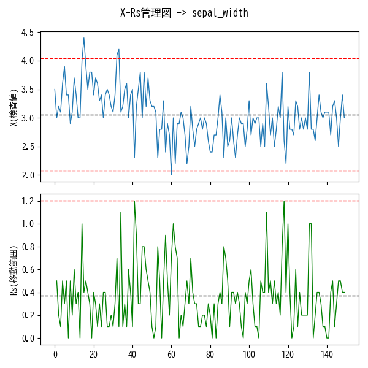
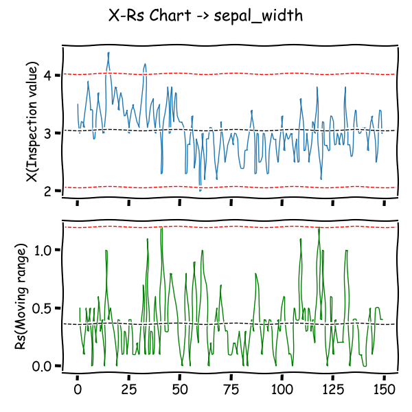

# py-mocks

A mock-up cli script set of [Welcome to Python.org](https://www.python.org/) that filter text-object input from the pipeline(stdin) and return text-object.

- For use in UTF-8 Japanese environments on windows.
- For my personal work and hobby use.
- Note that the code is spaghetti (due to my technical inexperience).
- Insufficient tests and error handlings.

script list:

```powershell
# one-liner to create function list
(cat README.md | sls '^#### \[[^[]+\]').Matches.Value.Replace('#### ','') -join ", " | Set-Clipboard
```

- [pycalc.py], [pymatcalc.py], [pysym.py], [pyplot.py], [pyplot-pandas.py], [pyplot-x-rs.py]


コード群にまとまりはないが、事務職（非技術職）な筆者の毎日の仕事（おもに文字列処理）を、より素早くさばくための道具としてのコマンドセットを想定している（毎日使用する関数は5個に満たないが）。

基本的に入力としてUTF-8で半角スペース区切り、行指向の文字列データ（テキストオブジェクト）を期待する、主にパターンマッチング処理を行うためのフィルタ群。Windows上でしか動かない関数も、ある。

`src`下のファイルは1ファイル1関数。基本的に他の関数には依存しないようにしているので、関数ファイル単体を移動して利用することもできる。（一部の関数は他の関数ファイルに依存しているものもある）

**充分なエラー処理をしていない**モックアップ。


## Install functions

1. Put `*.py` files under the `src` directory at any location.
2. Set terminal input/output encoding to `UTF-8`
    - The functions expect `UTF-8` encoded input, so if you want to run them on PowerShell in a Japanese environment, make sure the encoding is ready in advance.
    - if you use PowerShell, run the following dot sourcing command
        - `. path/to/py-mocks/operator.ps1`

関数群はUTF-8エンコードされた入力を期待するので、
関数実行前にカレントプロセスのエンコードを`UTF-8`にしておくとよい。

```powershell
# install favorite functions for japanese environment
# set encode
if ($IsWindows){
    chcp 65001
    [System.Console]::OutputEncoding = [System.Text.Encoding]::GetEncoding("utf-8")
    [System.Console]::InputEncoding  = [System.Text.Encoding]::GetEncoding("utf-8")
    # compartible with multi byte code
    $env:LESSCHARSET = "utf-8"
}
```

```powershell
# or sourcing dot files
. path/to/py-mocks/operator.ps1
```

## Description of each functions

各関数の挙動と作った動機と簡単な説明。


### Multipurpose

#### [pycalc.py] - Cli python-pandas executer

[pycalc.py]: src/pycalc.py

- Usage
    - man: `python pycalc.py -h`
    - `pycalc.py [-h] [-i INPUTFILE] [-d DELIMITER] [-m MODULE] [-v VARIABLE] [-n] [-q] [--index] [--datetime] [--nowrap] [--normalize] [--csv] [--tsv] [--ssv] [--max_rows MAX_ROWS] [--max_columns MAX_COLUMNS] [--max_colwidth MAX_COLWIDTH] [--size SIZE] [--debug] formula`
- Example
    - `python pycalc.py <formula;formula;...>`
    - `cat iris.csv | python pycalc.py -d "," "df.describe()"`
- Library
    - require: `argparse`, `numpy`, `pandas`


標準入力を df=pd.read_csv(sys.stdin, sep=delimiter)にて読み込む
`-i <file>`パイプライン経由でなくファイルからの入力も可能

`<formula>`はセミコロン区切りで複数指定可能。
formulaに`=`が含まれておればexec(formula)、
含まれないならans=eval(formula)が実行される。

ただし、()の中だけにイコールがある場合はevalになる。
たとえば`df.describe(include='all')`はeval。

`-v '<val1>=<str>;<val2>=<str>;...'`で変数に代入できる

Options:

```powershell
python pycalc.py -h
  -h, --help            show this help message and exit
  -i INPUTFILE, --inputfile INPUTFILE
                        input file name
  -d DELIMITER, --delimiter DELIMITER
                        line separator(delimiter)
  -m MODULE, --module MODULE
                        import modules
  -v VARIABLE, --variable VARIABLE
                        <variable>=<string>
  -n, --noheader        no header
  -q, --quiet           print as it is
  --index               col[0] as index
  --datetime            set df.columns[0] as datetime
  --nowrap              human readable for terminal
  --normalize           normalize data using unicodedata.normalize('NFKC')
  --csv                 output df as csv to stdout
  --tsv                 output df as tsv to stdout
  --ssv                 output df as ssv to stdout
  --max_rows MAX_ROWS   max rows
  --max_columns MAX_COLUMNS
                        max colmnss
  --max_colwidth MAX_COLWIDTH
                        max column width
  --size SIZE           graph size: w inch, h inch
  --debug               output dataframe
```

Examples:

```powershell
# describe
cat iris.ssv | python pycalc.py "df.dtypes"
cat iris.ssv | python pycalc.py "df.describe()"
cat iris.ssv | python pycalc.py "df.describe()" --nowrap
cat iris.ssv | python pycalc.py "df[df.columns[0:2]].describe()"
```

```powershell
# parse date examples
cat date.txt | python pycalc.py "df" --datetime
cat date.txt | python pycalc.py "df['date']=pd.to_datetime(df['date']);df['date2']=pd.to_datetime(df['date2']);df['diff']=df['date']-df['date2'];df.dropna()"
cat date.txt | python pycalc.py "df['date']=pd.to_datetime(df['date']).dt.strftime('%Y-%m-%d.%a');df"
cat date.txt | python pycalc.py "df['date']=pd.to_datetime(df['date']);df['timedelta_row']=df['date'].diff();df"
cat date.txt | python pycalc.py "df['date']=pd.to_datetime(df['date']);df['adddate']=df['date']+datetime.timedelta(days=31);df"
cat date.txt | python pycalc.py "df['date']=pd.to_datetime(df['date']);df['adddate']=df['date']-datetime.datetime.now();df"
cat date.txt | python pycalc.py "df['date']=pd.to_datetime(df['date']);df['add_date']=df['date']+pd.to_timedelta(df['val'], unit='d');df"
```

```powershell
# normalise using str.unicodedata.normalize('NKFC')
cat date.txt | python pycalc.py "df" --normalize
cat date.txt | python pycalc.py "df=df.applymap(lambda x: unicodedata.normalize('NFKC',x));df"
cat date.txt | python pycalc.py "df['ten']=df['ten'].str.normalize('NFKC');df"
cat date.txt | python pycalc.py "df['extract']=df['ten'].str.extract('(?P<city>新橋|日本橋)').dropna();df"
cat date.txt | python pycalc.py "df['address'] = df['address'].str.replace('〒[0-9]{3}\-[0-9]{4}', '')"
```

```powershell
# use apply
cat date.txt | python pycalc.py "df['len']=df['ten'].apply(len);df"
cat date.txt | python pycalc.py "df['len']=df['ten'].apply(lambda x: len(x));df"
```

```powershell
# output csv
cat iris.ssv |
    python pycalc.py -d " " "df.describe().to_csv()" |
    grep .

# fillna and output csv
cat iris.csv |
    python pycalc.py -d "," "df.fillna('NaN').to_csv()" |
    grep .
```

```powershell
# rename column name and print df
cat iris.csv | python pycalc.py -d "," "df.columns=['sl','sw','pl','pw','species']; df.head()"
cat iris.csv | python pycalc.py -d "," "df.columns=['sl','sw','pl','pw','species']; df.groupby('species').size()"
cat iris.csv | python pycalc.py -d "," "df.columns=['sl','sw','pl','pw','species']; df.groupby('species').mean()"
cat iris.csv | python pycalc.py -d "," "df.columns=['sl','sw','pl','pw','species']; a=df.groupby('species'); a.sum()"
cat iris.csv | python pycalc.py -d "," "df.columns=['sl','sw','pl','pw','species']; a=df.groupby('species'); a.std()"
cat iris.csv | python pycalc.py -d "," "df.columns=['sl','sw','pl','pw','species']; a=df.groupby('species'); a.var()"
```

```powershell
# groupby and aggregate
cat iris.csv | python pycalc.py -d "," "df.columns=['sl','sw','pl','pw','species']; df.groupby('species').agg('mean')"
cat iris.csv | python pycalc.py -d "," "df.columns=['sl','sw','pl','pw','species']; df.groupby('species').agg(lambda x: max(x) - min(x))"
cat iris.csv | python pycalc.py -d "," "df.columns=['sl','sw','pl','pw','species']; df.groupby('species').agg({'sl':'mean', 'sw':max, 'pl':np.min, 'pw':np.min})"
cat iris.csv | python pycalc.py -d "," "df.columns=['sl','sw','pl','pw','species']; df.groupby('species').describe()['sl']"
```

```powershell
# describe & include
cat iris.ssv | python pycalc.py "df.describe(include='all')"
cat iris.ssv | python pycalc.py "df.describe(include='object')"
cat iris.ssv | python pycalc.py "df.describe(include=[np.object, np.number])"

# describe & exclude
cat iris.ssv | python pycalc.py "df.describe(exclude=np.number)"
cat iris.ssv | python pycalc.py "df.describe(exclude=np.number).to_csv()" | grep .

# describe & percentiles
cat iris.ssv | 
    python pycalc.py "df.describe(percentiles=[0.1,0.2,0.5])"
    # 10%,20%,50%
```

```powershell
# 「species」列のカテゴリごとに要約統計量を出力
1..4 | %{ cat iris.csv | self $_ NF `
    | python pycalc.py "df.groupby('species').describe()" --nowrap -d ","
    }

```powershell
cat iris.csv | python pycalc.py "df[df.columns[:]].groupby('species').describe()" -d "," --nowrap
```

```powershell
# 変数の活用
echo 1 | python pycalc.py 's,t' -v 's=[i for i in range(6)];t=[i**2 for i in s]'
([0, 1, 2, 3, 4, 5], [0, 1, 4, 9, 16, 25])
```

```powershell
# Matplotlibを用いたグラフ描画
## formulaに"plot"または"plt"をみつけるとimport matplotlib as pltを読み込む
cat iris.csv | python pycalc.py -d "," "ax=df.groupby('species').max().plot.bar(rot=0);plt.show()"

# 式をセミコロンで区切ると複数の式を記述できる
echo 1 | python pycalc.py 'plt.plot(s,t);plt.show()' -v 's=[i for i in range(6)];t=[i**2 for i in s]'
[<matplotlib.lines.Line2D object at 0x7f96395f19a0>]
```

```powershell
# dataframe生成
echo 1 | python pycalc.py "df=pd.DataFrame({'city': ['osaka', 'osaka', 'osaka', 'osaka', 'tokyo', 'tokyo', 'tokyo'],'food': ['apple', 'orange', 'banana', 'banana', 'apple', 'apple', 'banana'],'price': [100, 200, 250, 300, 150, 200, 400],'quantity': [1, 2, 3, 4, 5, 6, 7]});df"
echo 1 | python pycalc.py "df=...; df.groupby('city').mean()"
echo 1 | python pycalc.py "df=...; df.groupby('city').mean().T"
echo 1 | python pycalc.py "df=...; df.groupby('city').size()"
echo 1 | python pycalc.py "df=...; df.groupby('city').size()['osaka']"

echo 1 | python pycalc.py "df=...; df.groupby(['city','food']).mean()"
echo 1 | python pycalc.py "df=...; df.groupby(['city','food'],as_index=False).mean()"

echo 1 | python pycalc.py "df=...; df.groupby('city').agg(np.mean)"
echo 1 | python pycalc.py "df=...; df.groupby('city').agg({'price': np.mean, 'quantity': np.sum})"
```

```powershell
# query
cat iris.csv | python pycalc.py -d "," "df.columns=['sl','sw','pl','pw','species'];df.query('sl < 5.0' )"
cat iris.csv | python pycalc.py -d "," "df.columns=['sl','sw','pl','pw','species'];df.query('4.9 <= sl < 5.0' )"
cat iris.csv | python pycalc.py -d "," "df.columns=['sl','sw','pl','pw','species'];df.query('sl > sw / 3' )"
cat iris.csv | python pycalc.py -d "," "df.columns=['sl','sw','pl','pw','species'];df.query('species == 'setosa'')"
cat iris.csv | python pycalc.py -d "," "df.columns=['sl','sw','pl','pw','species'];df.query('species in ['setosa']')"

cat iris.csv | python pycalc.py -d "," "df.columns=['sl','sw','pl','pw','species'];df.query('index % 2 == 0')"

cat iris.csv | python pycalc.py -d "," "df.columns=['sl','sw','pl','pw','species'];df.query('sl > 5.0 & sw < 2.5')"
cat iris.csv | python pycalc.py -d "," "df.columns=['sl','sw','pl','pw','species'];df.query('sl > 5.0 and sw < 2.5')"
```

### Math

#### [pymatcalc.py] - Cli matrix calculator by connecting with pipes

[pymatcalc.py]: src/pymatcalc.py

- Usage
    - man: `python pymatcalc.py [-h]`
    - `pymatcalc.py [-h] [-i INPUTFILE] [-q] [-t DTYPE] [-d DELIMITER] [-V] formula`
- Inspired by
    - [Ryuichi Ueda and CIT Autonomous Robot Lab](https://b.ueda.tech/?post=00674)
        - [GitHub - ryuichiueda/PMAT: Pipe Oriented Matrix Calculator](https://github.com/ryuichiueda/PMAT)
    - Command: `matcalc`, `pmat`
- Dependency
    - require: `argparse`, `numpy`

入力は複数行ならば行列、1行だけならばベクトルになる。
パイプラインを複数つなげれば演算結果を再利用できる。


Usage:

```powersell
pymatcalc '[<key>=]<formula>'

good: pymatcalc 'A@B'
good: pymatcalc 'C=A@B'

formulaに"="を用いる場合は、必ずkeyを指定すること。

good: pymatcalc 'C=np.eye(1, dtype=int)'
ng:   pymatcalc 'np.eye(1, dtype=int)'
```

Input format:
```
label val val val
label val val val
label val val val
```

Functions:

```powershell
# スカラー積: pymatcalc 'C=A*B'
# アダマール積: pymatcalc 'C=np.multiply(A, B)'
# 単位行列1: pymatcalc 'C=np.eye(n, dtype=int)'
# 単位行列2: pymatcalc 'C=np.identity(n, dtype=int)'
# 転置行列: pymatcalc 'C=A.T'
# 行列式: pymatcalc 'C=np.linalg.det(A)*np.eye(1)'
# - 出力が値の場合は単位行列を掛ける
# 逆行列: pymatcalc 'np.linalg.inv(A)'
# 固有値と固有ベクトル: pymatcalc 'np.linalg.eig(A)[0]'
# 固有値と固有ベクトル: pymatcalc 'np.linalg.eig(A)[1]'
# 内積（ドット積）: pymatcalc 'np.dot(A, B)'
# 行列積1: pymatcalc 'A@B'
# 行列積2: pymatcalc 'np.matmul(A, B)'
# ベクトル内積: pymatcalc 'np.inner(A, B)'
# ベクトル外積: pymatcalc 'np.outer(A, B)'
# ランダム行列の生成: 'C=np.random.randint(-10,10,size=(3,3))'
```

EXAMPLES:

```powershell
# input example:
$ cat matrix
A 1 1
A 2 4
B 4 3
B 2 1
```

```powershell
# calc example:
$ cat matrix | python pymatcalc.py 'A*B'
A 1 1
A 2 4
B 4 3
B 2 1
A*B 4.0 3.0
A*B 4.0 4.0

$ cat matrix | python pymatcalc.py 'A@B'
$ cat matrix | python pymatcalc.py 'np.matmul(A, B)'
A 1 1
A 2 4
B 4 3
B 2 1
A@B 6.0 4.0
A@B 16.0 10.0
```

```powershell
# np.eye(n), np.identity(n)
$ cat matrix | python pymatcalc.py'C=np.eye(3,dtype=int)'
$ cat matrix | python pymatcalc.py'C=np.identity(3,dtype=int)'
A 1 1
A 2 4
B 4 3
B 2 1
C 1 0 0
C 0 1 0
C 0 0 1
```

```powershell
# add new label to ans:
$ cat matrix | python pymatcalc.py 'C=A*B'
A 1 2
A 3 4
B 4 3
B 2 1
C 4.0 6.0
C 6.0 4.0
```

```powershell
# determinant:
#  To output value (not matrix), multiply np.eye(1)
$ cat matrix | python pymatcalc.py 'C=np.linalg.det(A)*np.eye(1)'
A 2 -6 4
A 7 2 3
A 8 5 -1
C -144.0
```

```powershell
# invert:
$ cat matrix | python pymatcalc.py 'C=np.linalg.inv(A)'
A -4 2
A 7 2
C -0.0909090909090909 0.09090909090909091
C 0.3181818181818182 0.1818181818181818

# test invert
$ cat matrix | python pymatcalc.py 'C=np.dot(A, np.linalg.inv(A))'
A -4 2
A 7 2
C 1.0 -5.551115123125783e-17
C 1.1102230246251565e-16 1.0
```

```powershell
# chain calc using pipe:
$ cat matrix | python pymatcalc.py 'C=A@B' | python pymatcalc.py 'D=A@C'
$ cat matrix | python pymatcalc.py 'C=A@(A@B)'
A 1 2
A 3 4
B 4 3
B 2 1
C 8.0 5.0
C 20.0 13.0
D 48.0 31.0
D 104.0 67.0
```

#### [pysym.py] - sympy oneliner

[pysym.py]: src/pysym.py

[sympy](https://docs.sympy.org/latest/index.html)ワンライナー。

- Usage
    - man: `python pysym.py -h`
    - `pysym.py [-h] [-l] [-u] [-s] [--sympify] [--dot] [-m MODULE] [-v VARIABLE] [-i INPUTFILE] [--size SIZE] [--debug]`
- Example
    - `pysym.py 'x**2 - 2*x - 15' [--latex|--simplify|--dot] [--sympify]`
    - `pysym.py 'sympy.factor(x**2 - 2*x - 15)'`
    - `pysym.py 'sympy.factor(x**2 - 2*x - 15).subs(x,2)'`
        - 数式をsympyが解釈して出力
        - `--latex` : latex数式変換
        - `--dot` : graphviz描画用dot言語変換
        - `--sympify` : 数式を文字列として渡す。<br />ただし数式中に`=`がある場合はうまく動作しない
- Options
    - `-v '<val1>=<str>;<val2>=<str>;...'`で変数に代入できる
- Dependencies
    - `sympy`, `argparse`, `numpy`, `matplotlib`
- Notes
    - Default settings
        - `sympy.init_printing(use_unicode=True)`
        - `x, y, z = sympy.symbols('x y z')`
        - `a, b, c = sympy.symbols('a b c')`
        - `import sympy`
        - `from sympy import symbols`
        - `from sympy import Eq, solve, diff, integrate, factorial, factor, summation`
        - `from sympy import sin, cos, tan, atan, log, I, pi, E, exp, sqrt`
        - `from sympy import Matrix, plot`
        - `from sympy.printing.dot import dotprint`
        - `import io, sys, os, re`
        - `import numpy as np`
        - `import math`
        - `import matplotlib.pyplot as plt`

Examples:

**電卓として使う**

```powershell

pysym.py '1+2'
# 電卓として使う: 3

pysym.py '1.2e2'
# 電卓として使う: 120.0

pysym.py 'sympy.factorial(10)'
# 電卓として使う: 3628800

pysym.py "sympy.expand('(x+y)*(x-y)')"
# 多項式の展開: x**2 - y**2

pysym.py 'type(1.2e2)'
# pythonコマンドの実行: <class 'float'>
# 内部でevalを用いているので、こういうことができる
```

**数式の演算・シンプル化・LaTeX形式変換**

```powershell
pysym.py 'x**2 + 2*x + 1'
# 数式表示: x**2 + 2*x + 1

pysym.py 'x**2 + 2*x + 1' --latex (-l)
# latex変換: x^{2} + 2 x + 1

pysym.py '(x**2 + 2*x + 1).subs(x,1)'
# 値の代入: 4

pysym.py '(x**2 + 2*x + 1 + y**2).subs([(x,1),(y,2)])'
# 複数の値の代入はタプルを用いる: 8
```

**変数オプション-vを活用する**

```powershell
pysym.py 'x**2 + 2*x + 1 + X*Y' -v "X,Y=sympy.symbols('X Y')"
# 記号の追加は-vオプションでできる: X*Y + x**2 + 2*x + 1

pysym.py 'x**2 + 2*x + 1 + X*Y*Z' -v "X, Y=sympy.symbols('X Y');Z=sympy.symbols('Z')"
# -vオプションはセミコロン;区切りで複数指定可能: X*Y*Z + x**2 + 2*x + 1

pysym.py 'f(x)' -v 'def f(x): return x**2'
# python式に関数定義: x**2

pysym.py 'sympy.solve(sympy.Eq(f(x), g(x)), x)' -v 'def f(x): return x**2 - 1; def g(x): return 4*x - 5'
# y = x**2 -1 と y = 4*x - 5 が交差または接している点の x 座標: [2]
↓
# 解が一つなので1点で接している。その座標は？
pysym.py '2,f(2)' -v 'def f(x): return x**2 - 1; def g(x): return 4*x - 5;'
# (2, 3)
↓
# 接線の傾き
pysym.py 'sympy.diff(f(x), x).subs(x, 2)' -v 'def f(x): return x**2 - 1; def g(x): return 4*x - 5;'
# 4

# 2次方程式の解の公式
pysym.py 'sympy.Eq(a*x**2+b*x+c, (-b + sympy.sqrt(-4*a*c + b**2))/(2*a))' --latex
# normal: Eq(a*x**2 + b*x + c, (-b + sqrt(-4*a*c + b**2))/(2*a))
# latex:  a x^{2} + b x + c = \frac{- b + \sqrt{- 4 a c + b^{2}}}{2 a}
```

**いろいろな演算**

```powershell
pysym.py 'sympy.solve([3*x + 5*y -29, x + y - 7])'
# 連立方程式を解く: {x: 3, y: 4}

pysym.py 'sympy.summation(k, (k, 1, 10) )' -v "k=sympy.symbols('k', integer = True)"
# 総和を求める: 55

pysym.py 'sympy.factor(sympy.summation(k, (k, 1, N) ))' -v "k, N=sympy.symbols('k N', integer = True)"
# 総和。上限を文字にしてもいい: N*(N + 1)/2

pysym.py 'f(x)' -v 'def f(x): return x**2'
# python式に関数定義: x**2

pysym.py 'sympy.factor(x**2 + 2*x + 1)'
# 因数分解: (x + 1)**2

pysym.py 'sympy.diff(x**2 - 2*x - 15)'
# 微分: 2*x - 2

pysym.py 'sympy.integrate(x**2 - 2*x - 15)'
# 積分: x**3/3 - x**2 - 15*x

pysym.py 'sympy.integrate(x**2 - 2*x - 15, (x, 0, 10))'
# 定積分: 250/3

pysym.py 'sympy.solve([x + 5*y - 2, -3*x + 6*y - 15], [x, y])'
# 方程式の求解: {x: -3, y: 1}
```

**calc matrix: 行列の演算**

- thanks: [SymPyの使い方10 ～ 行列の定義・操作 - つれづれなる備忘録](https://atatat.hatenablog.com/entry/sympy10_matrix)

```powershell
pysym.py 'sympy.Matrix([[a, b], [c, d]])' -v 'a,b,c=sympy.symbols("a b c"); d,e,f=sympy.symbols("d e f")'
# 行列の定義: Matrix([[a, b], [c, d]])

pysym.py 'sympy.Matrix([x, y])'
# 列ベクトルの定義: Matrix([[x], [y]])

pysym.py 'sympy.Matrix([[x, y]])'
# 行ベクトルの定義: Matrix([[x, y]])

pysym.py 'A*B' -v 'd=sympy.symbols("d");A=sympy.Matrix([[a, b], [c, d]]);B=sympy.Matrix([x, y])'
# Matrix([[a*x + b*y], [c*x + d*y]])

pysym.py 'A+B' -v 'A=sympy.Matrix([[1,2], [3,4]]);B=sympy.Matrix([[3, 4],[5,6]])'
# 行列の和: Matrix([[4, 6], [8, 10]])

pysym.py 'A.shape' -v 'd=sympy.symbols("d");A=sympy.Matrix([[a, b], [c, d]])'
# 行列の数を取得: (2, 2)

pysym.py 'A.row(0)' -v 'd=sympy.symbols("d");A=sympy.Matrix([[a, b], [c, d]])'
# 行列の成分を取得: Matrix([[a, b]])

pysym.py 'A.col(1)' -v 'd=sympy.symbols("d");A=sympy.Matrix([[a, b], [c, d]])'
# 行列の成分を取得: Matrix([[b], [d]])

pysym.py 'A.transpose()' -v 'd=sympy.symbols("d");A=sympy.Matrix([[a, b], [c, d]])'
# 行列の転置: Matrix([[a, c], [b, d]])

pysym.py 'A.det()' -v 'd=sympy.symbols("d");A=sympy.Matrix([[a, b], [c, d]])'
# 行列式（determinant）: a*d - b*c

pysym.py 'A.inv()' -v 'd=sympy.symbols("d");A=sympy.Matrix([[a, b], [c, d]])'
pysym.py 'A**(-1)' -v 'd=sympy.symbols("d");A=sympy.Matrix([[a, b], [c, d]])'
# 逆行列: Matrix([[d/(a*d - b*c), -b/(a*d - b*c)], [-c/(a*d - b*c), a/(a*d - b*c)]])

pysym.py 'A.eigenvals()' -v 'd=sympy.symbols("d");A=sympy.Matrix([[a, b], [c, d]])'
# 固有値: {a/2 + d/2 - sqrt(a**2 - 2*a*d + 4*b*c + d**2)/2: 1, a/2 + d/2 + sqrt(a**2 - 2*a*d + 4*b*c + d**2)/2: 1}

pysym.py 'A.eigenvects()' -v 'd=sympy.symbols("d");A=sympy.Matrix([[a, b], [c, d]])'
# 固有ベクトル:
# [(a/2 + d/2 - sqrt(a**2 - 2*a*d + 4*b*c + d**2)/2, 1, [Matrix([
# [-d/c + (a/2 + d/2 - sqrt(a**2 - 2*a*d + 4*b*c + d**2)/2)/c],
# [                                                         1]])]), (a/2 + d/2 + sqrt(a**2 - 2*a*d + 4*b*c + d**2)/2, 1, [Matrix([
# [-d/c + (a/2 + d/2 + sqrt(a**2 - 2*a*d + 4*b*c + d**2)/2)/c],
# [                                                         1]])])]

pysym.py 'A.rref()' -v 'd=sympy.symbols("d");A=sympy.Matrix([[5, -2, 5], [1, 1, 8]])'
# 階段行列:
# (Matrix([
# [1, 0, 3],
# [0, 1, 5]]), (0, 1))
```

** Matplotlibを用いたplot（グラフ描画）**

```powershell
pysym.py "sympy.plot(sin(x), (x, -2*pi, 2*pi))"
pysym.py "sympy.plot(sin(x), (x, -2*pi, 2*pi), title='タイトル', xlabel='横軸')"
# サインカーブ

pysym.py 'plt.plot(s,t);plt.show()' -v 's=[i for i in range(6)];t=[i**2 for i in s]'
[<matplotlib.lines.Line2D object at 0x7fe4c0a20670>]
# matplotlib : plt.show()使用例

pysym.py 'sympy.plot_parametric(cos(x), sin(x), (x, 0, 2*pi))' --size 5,5
# グラフサイズの指定 --size width,height
```


### Graph and chart

#### [pyplot.py] - Plot chart using matplotlib

[pyplot.py]: src/pyplot.py

棒グラフなどのチャートをプロットする。入力はパイプライン経由の半角スペース区切り「ヘッダあり」データを期待する。Wrapper of `matplotlib`. 

- Usage
    - man: `python pyplot.py [-h|--help]`
    - `python pyplot.py [-h] [-d DELIMITER] [-o OUTPUT] [-i INPUTFILE] [--dpi DPI] [--x X] [--y Y] [--size SIZE] [--layout LAYOUT]`
- Examples
    - `cat iris.csv | python pyplot.py -d ","`
    - `cat iris.csv | python pyplot.py -d "," --index`
    - `cat date.csv | python pyplot.py -d "," --datetime --minterval 2 --rot 90 --dformat "%Y-%m`n(%a)"`
    - `cat iris.csv | python pyplot.py -d "," --sorta 1,2`
    - `cat iris.csv | python pyplot.py -d "," --pair --hue 5`
    - `cat iris.csv | python pyplot.py -d "," --pair --hue 5 --seaborn`
    - `cat iris.csv | python pyplot.py -d "," --scatter --x 1 --y 3`
    - `cat iris.csv | python pyplot.py -d "," --scatter --x 1 --y 3 --hue 5`
    - `cat iris.csv | python pyplot.py -d "," --scatter --x 1 --y 3 --lm`
- Dependency
    - require: `argparse`, `numpy`, `pandas`, `matplotlib.dates`


Usage:

```powershell
python pyplot.py --help

usage: pyplot.py [-h] [-d DELIMITER] [-o OUTPUT] [-i INPUTFILE] [--dpi DPI] [--x X] [--y Y] [--size SIZE] [--layout LAYOUT]
    [--fontsize FONTSIZE] [--fontsizet FONTSIZET] [--anzu] [--natsume] [--natsumeo] [--nofont] [--self SELF] [--delf DELF]
    [--sorta SORTA] [--sortd SORTD] [--noheader] [--notskipobject] [--index] [--datetime] [--dformat DFORMAT]
    [--yinterval YINTERVAL] [--minterval MINTERVAL] [--dinterval DINTERVAL] [--winterval WINTERVAL]
    [--datetimelocate {year,month,day,hour,minute,auto,monday,tuesday,wednesday,thursday,friday,saturday,sunday}]
    [--datetimeinterval DATETIMEINTERVAL] [--mtype MTYPE] [--scatter] [--line] [--step] [--bar] [--barh] [--hist] [--box]
    [--kde] [--area] [--pie] [--hexbin] [--joint] [--pair]
    [--style {bmh,classic,dark_background,fast,fivethirtyeight,ggplot,grayscale,seaborn-bright,seaborn-colorblind,seaborn-dark-palette,seaborn-dark,seaborn-darkgrid,seaborn-deep,seaborn-muted,seaborn-notebook,seaborn-paper,seaborn-pastel,seaborn-poster,seaborn-talk,seaborn-ticks,seaborn-white,seaborn-whitegrid,seaborn,Solarize_Light2,tableau-colorblind10,_classic_test}]
    [--lm] [--hue HUE] [--offlegend]
    [--legendloc {best,upper right,upper left,lower left,lower right,right,center left,center right,lower center,upper center,center}]
    [--legendloc2 LEGENDLOC2] [--adjust ADJUST] [--title TITLE] [--offtitle] [--spines {zero,center}] [--reverse]
    [--xlab XLAB] [--ylab YLAB] [--xlim XLIM] [--ylim YLIM] [--ymin YMIN] [--ymax YMAX] [--grid] [--gridx] [--gridy]
    [--logx] [--logy] [--logxy] [--rot ROT] [--linewidth LINEWIDTH] [--hline HLINE] [--hlinewidth HLINEWIDTH]
    [--hlinecolor HLINECOLOR] [--hline0] [--vline VLINE] [--vlinecolor VLINECOLOR] [--vlinewidth VLINEWIDTH]
    [--hspan HSPAN] [--hspancolor HSPANCOLOR] [--hspanalpha HSPANALPHA] [--vspan VSPAN] [--vspancolor VSPANCOLOR]
    [--vspanalpha VSPANALPHA] [--today] [--now] [--seaborn] [--monochrome] [--mycolormap] [--debug] [--y2] [--y2lim Y2LIM]
    [--logy2] [--y2lab Y2LAB] [--y2color Y2COLOR] [--grep GREP] [--gcolor GCOLOR] [--gcolor2 GCOLOR2] [--xrs XRS] [--xkcd]
```

Examples:

```powershell
# 区切りは -d "<separator>"で変更可能。
# デフォルトで半角スペース区切り入力を期待
cat iris.csv | python pyplot.py -d ","
```

```powershell
# --indexで、1列目をpandas dataframeのindexとみなす
cat iris.csv | python pyplot.py -d "," --index
```

```powershell
# --datetimeで、1列目をpandas dataframeのdatetime型indexとみなす
cat date.csv | python pyplot.py -d "," --datetime --minterval 2 --rot 90 --dformat "%Y-%m`n(%a)"
```

```powershell
# --pairでペアプロット（行列散布図）を描画
cat iris.csv | python pyplot.py -d "," --pair --hue 5
cat iris.csv | python pyplot.py -d "," --pair --hue 5 --seaborn
```

```powershell
# --scatterで散布図を描画。デフォルトで1,2列目を使用
cat iris.csv | python pyplot.py -d "," --scatter
cat iris.csv | python pyplot.py -d "," --scatter --x 1 --y 3
# --hue <column-number>で任意列を用いて層別に色分け
cat iris.csv | python pyplot.py -d "," --scatter --x 1 --y 3 --hue 5
```

```powershell
# 散布図に最小二乗法を適用し回帰直線をプロット。同時に線形回帰式及びR^2値を凡例に表示
cat iris.csv | python pyplot.py -d "," --scatter --x 1 --y 3 --lm
```

Options:

```powershell
python pyplot.py --help

options:
  -h, --help            show this help message and exit
  -d DELIMITER, --delimiter DELIMITER
                        line separator(delimiter)
  -o OUTPUT, --output OUTPUT
                        output file name
  -i INPUTFILE, --inputfile INPUTFILE
                        input file name
  --dpi DPI             output dpi
  --x X                 x columns in scatter plot
  --y Y                 y columns in scatter plot
  --size SIZE           w inch, h inch
  --layout LAYOUT       subplot layout
  --fontsize FONTSIZE   fontsize
  --fontsizet FONTSIZET
                        title fontsize
  --anzu                font: anzu
  --natsume             font: natsume
  --natsumeo            font: natsume osae
  --nofont              do not set font
  --self SELF           select fields
  --delf DELF           delete fields
  --sorta SORTA         sort by ascending
  --sortd SORTD         sort by descending
  --noheader            noheader data
  --notskipobject       do not skip object dtype
  --index               set df.columns[0] as index
  --datetime            set df.columns[0] as datetime
  --dformat DFORMAT     xaxis datetime formatter
  --yinterval YINTERVAL
                        year interval
  --minterval MINTERVAL
                        month interval
  --dinterval DINTERVAL
                        day interval
  --winterval WINTERVAL
                        weekday interval
  --datetimelocate {year,month,day,hour,minute,auto,monday,tuesday,wednesday,thursday,friday,saturday,sunday}
                        xaxis datetime locater
  --datetimeinterval DATETIMEINTERVAL
                        xaxis date interval
  --mtype MTYPE         marker type
  --scatter             graph type: scatter
  --line                graph type: line
  --step                graph type: line + step
  --bar                 graph type: bar plot
  --barh                graph type: bar plot
  --hist                graph type: histogram
  --box                 graph type: box plot
  --kde                 graph type: Kernel density estimation
  --area                graph type: area
  --pie                 graph type: pie chart
  --hexbin              graph type: hexbin
  --joint               graph type: Plotting joint and marginal distributions
  --pair                graph type: pair plot
  --style {bmh,classic,dark_background,fast,fivethirtyeight,ggplot,grayscale,seaborn-bright,seaborn-colorblind,seaborn-dark-palette,seaborn-dark,seaborn-darkgrid,seaborn-deep,seaborn-muted,seaborn-notebook,seaborn-paper,seaborn-pastel,seaborn-poster,seaborn-talk,seaborn-ticks,seaborn-white,seaborn-whitegrid,seaborn,Solarize_Light2,tableau-colorblind10,_classic_test}
                        graph style
  --lm                  set least square methods line in scatter plot
  --hue HUE             hue label columns
  --offlegend           legend switch
  --legendloc {best,upper right,upper left,lower left,lower right,right,center left,center right,lower center,upper center,center}
                        legend location
  --legendloc2 LEGENDLOC2
                        legend location
  --adjust ADJUST       space adjust. eg: 0.1,0.8
  --title TITLE         title
  --offtitle            disable scatter plot title
  --spines {zero,center}
                        set spines(ticks location)
  --reverse             reverse y axis
  --xlab XLAB           x axis label
  --ylab YLAB           y axis label
  --xlim XLIM           x axis limit
  --ylim YLIM           y axis limit
  --ymin YMIN           y axis min
  --ymax YMAX           y axis max
  --grid                grid
  --gridx               grid x-axis
  --gridy               grid y-axis
  --logx                logx
  --logy                logy
  --logxy               logxy
  --rot ROT             xlab rotate
  --linewidth LINEWIDTH
                        line width
  --hline HLINE         horizon lines
  --hlinewidth HLINEWIDTH
                        horizon line width
  --hlinecolor HLINECOLOR
                        horizon line colors
  --hline0              add y zero line
  --vline VLINE         vertical lines
  --vlinecolor VLINECOLOR
                        vertical line colors
  --vlinewidth VLINEWIDTH
                        vorizon line width
  --hspan HSPAN         fill h-range
  --hspancolor HSPANCOLOR
                        fillcolor h-range
  --hspanalpha HSPANALPHA
                        fillcolor alpha h-range
  --vspan VSPAN         fill v-range
  --vspancolor VSPANCOLOR
                        fillcolor v-range
  --vspanalpha VSPANALPHA
                        fillcolor alpha v-range
  --today               add today vline
  --now                 add now datetime vline
  --seaborn             pair plot
  --monochrome          monochrome line
  --mycolormap          my color map
  --debug               output dataframe
  --y2                  secondary y axis columns
  --y2lim Y2LIM         y2 axis limit
  --logy2               logy2
  --y2lab Y2LAB         y2 axis label
  --y2color Y2COLOR     y2 axis color
  --grep GREP           bar, barhのみ、ヒットしたラベルのバーに色付けする
  --gcolor GCOLOR       ヒットしたバーの色
  --gcolor2 GCOLOR2     ヒットしなかったバーの色
  --xrs XRS             add x-Rs hline
  --xkcd                xkcd
```

```powershell
python pyplot.py --help

EXAMPLES:
    cat iris.csv | python pyplot.py -d ","
    cat iris.csv | python pyplot.py -d "," --index
    cat date.csv | python pyplot.py -d "," --datetime --minterval 2 --rot 90 --dformat "%Y-%m`n(%a)"
    cat iris.csv | python pyplot.py -d "," --sorta 1,2
    cat iris.csv | python pyplot.py -d "," --pair --hue 5
    cat iris.csv | python pyplot.py -d "," --pair --hue 5 --seaborn
    cat iris.csv | python pyplot.py -d "," --scatter --x 1 --y 3
    cat iris.csv | python pyplot.py -d "," --scatter --x 1 --y 3 --hue 5
      -> 層別（分類別）に色分けした散布図を描画。
    cat iris.csv | python pyplot.py -d "," --scatter --x 1 --y 3 --lm
      -> 散布図に最小二乗法を適用し回帰直線をプロット。同時に線形回帰式及びR^2値を凡例に表示
    cat iris.csv | self 1 | python pyplot.py -d "," --xrs 1
      -> 1列目のデータを用いてX-Rs線を引く

    ## fill range
    cat iris.csv | python pyplot.py -d ","  --vspan 60,80 --vspancolor gray

    cat iris.csv | python pyplot.py -d "," --hist --subplots --layout 2,2
    python pyplot.py -i iris.csv -d ","
    python pyplot.py -i iris.csv -d "," --spines "zero"
        -> グラフ交点ticksをy=0にセット。 --spines "center"で交点を中央にセット。
    python pyplot.py -i iris.csv -d "," --monochrome
    python pyplot.py -i iris.csv -d ',' --y2 --y2color "tab:red"

    ## 水平線を引く
    python pyplot.py -i iris.csv -d ',' --hline 1.3
    python pyplot.py -i iris.csv -d ',' --hline 3.0,2.0 --hlinecolor r,g
      -> 水平線を引く。カンマ区切りで複数引けるが、その際は
         hline, hlinecolorの引数の数を一致させる必要がある、
         vlineも同じ。

    cat datetime.txt | python pyplot.py --datetime
    cat datetime.txt | python pyplot.py --datetime --datetimelocate sunday --dformat '%H-%M\n(%a)' --rot 45 --grid
    cat datetime.txt | python pyplot.py --datetime --datetimelocate day --datetimeinterval 5

    ## legend locate
    cat iris.csv | python pyplot.py --legendloc2 1,1,1 ## 凡例を外に。
```

#### [pyplot-pandas.py] - Plot chart using matplotlib and pandas

[pyplot-pandas.py]: src/pyplot-pandas.py

棒グラフなどのチャートをプロットする。入力はパイプライン経由の半角スペース区切り「ヘッダあり」データを期待する。Wrapper of `pandas plot`. 

`pyplot.py`とはチャートのプロットに`matplotlib`を用いる点は同じだが、`pandas plot`を用いる点が異なる。描画できるチャートの種類は`pyplot.py`よりも少ないが、コードの行数も少なくてシンプル。

- Usage
    - man: `python pyplot-pandas.py [-h|--help]`
    - `python pyplot-pandas.py [-h] [-d DELIMITER] [-o OUTPUT] [-i INPUTFILE] [--dpi DPI] [--scatter] [--line] [--step] [--where {pre,post,mid}]`
- Examples
    - `cat iris.csv | python pyplot-pandas.py -d ","`
    - `cat iris.csv | python pyplot-pandas.py -d "," --index`
    - `cat date.txt | python pyplot-pandas.py --datetime`
- Dependency
    - require: `argparse`, `numpy`, `pandas`, `matplotlib.dates`

Usage:

```powershell
python pyplot-pandas.py --help

usage: pyplot-pandas.py [-h] [-d DELIMITER] [-o OUTPUT] [-i INPUTFILE] [--dpi DPI] [--scatter] [--line] [--step] [--where {pre,post,mid}]
    [--bar] [--barh] [--hist] [--box] [--kde] [--area] [--pie] [--hexbin] [--joint] [--pair] [--x X] [--y Y]
    [--hue HUE] [--y2 Y2] [--xname XNAME] [--yname YNAME] [--huename HUENAME] [--y2name Y2NAME] [--col COL]
    [--by BY] [--colname COLNAME] [--byname BYNAME] [--gridsize GRIDSIZE] [--color COLOR] [--anzu] [--natsume]
    [--natsumeo] [--nofont] [--pielabel PIELABEL] [--piepercent PIEPERCENT] [--pieborder PIEBORDER]
    [--pieradius PIERADIUS] [--pierev] [--piestartangle PIESTARTANGLE] [--lm] [--printinfo]
    [--theme {darkgrid,dark,whitegrid,white,ticks}] [--context {paper,notebook,talk,poster}]
    [--palette {deep,muted,pastel,bright,dark,colorblind,hls,husl}] [--color_codes] [--font_scale FONT_SCALE]
    [--size SIZE] [--layout LAYOUT] [--noheader] [--index] [--alpha ALPHA] [--sorta SORTA] [--sortd SORTD]
    [--datetime] [--dformat DFORMAT] [--yinterval YINTERVAL] [--minterval MINTERVAL] [--dinterval DINTERVAL]
    [--winterval WINTERVAL]
    [--datetimelocate {year,month,day,hour,minute,auto,monday,tuesday,wednesday,thursday,friday,saturday,sunday}]
    [--datetimeinterval DATETIMEINTERVAL]
    [--style {bmh,classic,dark_background,fast,fivethirtyeight,ggplot,grayscale,seaborn-bright,seaborn-colorblind,seaborn-dark-palette,seaborn-dark,seaborn-darkgrid,seaborn-deep,seaborn-muted,seaborn-notebook,seaborn-paper,seaborn-pastel,seaborn-poster,seaborn-talk,seaborn-ticks,seaborn-white,seaborn-whitegrid,seaborn,Solarize_Light2,tableau-colorblind10,_classic_test}]
    [--jitter] [--swarm] [--jointkind {scatter,reg,resid,kde,hex}] [--mstyle MSTYLE] [--msize MSIZE]
    [--mfillcolor MFILLCOLOR] [--medge MEDGE] [--medgecolor MEDGECOLOR] [--colormap COLORMAP] [--mycolormap]
    [--offcolorbar] [--hatch HATCH] [--linewidth LINEWIDTH] [--hline HLINE] [--hlinewidth HLINEWIDTH]
    [--hlinecolor HLINECOLOR] [--hline0] [--vline VLINE] [--vlinecolor VLINECOLOR] [--vlinewidth VLINEWIDTH]
    [--hspan HSPAN] [--hspancolor HSPANCOLOR] [--hspanalpha HSPANALPHA] [--vspan VSPAN] [--vspancolor VSPANCOLOR]
    [--vspanalpha VSPANALPHA] [--today] [--now] [--legend] [--offlegend]
    [--legendloc {best,upper right,upper left,lower left,lower right,right,center left,center right,lower center,upper center,center}]
    [--legendloc2 LEGENDLOC2] [--adjust ADJUST] [--title TITLE] [--xlab XLAB] [--ylab YLAB] [--xlim XLIM]
    [--ylim YLIM] [--xstep XSTEP] [--ystep YSTEP] [--xstep2 XSTEP2] [--ystep2 YSTEP2] [--xticks XTICKS]
    [--yticks YTICKS] [--xfmt XFMT] [--yfmt YFMT] [--x10n X10N] [--y10n Y10N] [--grid] [--grid2] [--xrs XRS]
    [--xrsname XRSNAME] [--subplots] [--reverse] [--sharex] [--sharey] [--logx] [--logy] [--logxy] [--stacked]
    [--rot ROT] [--fontsize FONTSIZE] [--fontsizet FONTSIZET] [--seaborn] [--monochrome] [--xkcd] [--debug]
```

Examples:

```powershell
# 区切りは -d "<separator>"で変更可能。
# デフォルトで半角スペース区切り入力を期待
cat iris.csv | python pyplot-pandas.py -d ","
```

```powershell
# --indexで、1列目をpandas dataframeのindexとみなす
cat iris.csv | python pyplot-pandas.py -d "," --index
```


```powershell
# --datetimeで、1列目をpandas dataframeのdatetime型indexとみなす
cat date.txt | python pyplot-pandas.py --datetime
cat date.csv | python pyplot.py -d "," --datetime --minterval 2 --rot 90 --dformat "%Y-%m`n(%a)"
```

Detailed:

```powershell
python pyplot-pandas.py --help

Option:
  -h, --help            show this help message and exit
  -d DELIMITER, --delimiter DELIMITER
                        line separator(delimiter)
  -o OUTPUT, --output OUTPUT
                        output file name
  -i INPUTFILE, --inputfile INPUTFILE
                        input file name
  --dpi DPI             output dpi
  --scatter             graph type: scatter
  --line                graph type: line
  --step                graph type: line + step
  --where {pre,post,mid}
                        graph type: line + step config
  --bar                 graph type: bar plot
  --barh                graph type: bar plot
  --hist                graph type: histogram
  --box                 graph type: box plot
  --kde                 graph type: Kernel density estimation
  --area                graph type: area
  --pie                 graph type: pie chart
  --hexbin              graph type: hexbin
  --joint               graph type: Plotting joint and marginal distributions
  --pair                graph type: pair plot
  --x X                 x colnum
  --y Y                 y colnum
  --hue HUE             hue colnum
  --y2 Y2               secondary y axis columns
  --xname XNAME         x colname
  --yname YNAME         y colname
  --huename HUENAME     hue colname
  --y2name Y2NAME       y2 colname
  --col COL             box colnum: box
  --by BY               box group by: box
  --colname COLNAME     box colname: box
  --byname BYNAME       box group by: box
  --gridsize GRIDSIZE   gridsize: hexbin
  --color COLOR         color
  --anzu                font: anzu
  --natsume             font: natsume
  --natsumeo            font: natsume osae
  --nofont              do not set font
  --pielabel PIELABEL   label column in pie plot
  --piepercent PIEPERCENT
                        add perent label in pie plot
  --pieborder PIEBORDER
                        border width in pie plot
  --pieradius PIERADIUS
                        radius of pie plot
  --pierev              reverse label clock in pie plot
  --piestartangle PIESTARTANGLE
                        start angle in pie plot
  --lm                  set least square line in scatter plot
  --printinfo           print corr and formula
  --theme {darkgrid,dark,whitegrid,white,ticks}
                        set seaborn theme
  --context {paper,notebook,talk,poster}
                        set seaborn context
  --palette {deep,muted,pastel,bright,dark,colorblind,hls,husl}
                        set seaborn palette
  --color_codes         color_codes
  --font_scale FONT_SCALE
                        font scale
  --size SIZE           w inch, h inch
  --layout LAYOUT       subplot layout
  --noheader            noheader data
  --index               set df.columns[0] as index
  --alpha ALPHA         alpha betw 0 and 1
  --sorta SORTA         sort by ascending
  --sortd SORTD         sort by descending
  --datetime            set df.columns[0] as datetime
  --dformat DFORMAT     xaxis datetime formatter
  --yinterval YINTERVAL
                        year interval
  --minterval MINTERVAL
                        month interval
  --dinterval DINTERVAL
                        day interval
  --winterval WINTERVAL
                        weekday interval
  --datetimelocate {year,month,day,hour,minute,auto,monday,tuesday,wednesday,thursday,friday,saturday,sunday}
                        xaxis datetime locater
  --datetimeinterval DATETIMEINTERVAL
                        xaxis date interval
  --style {bmh,classic,dark_background,fast,fivethirtyeight,ggplot,grayscale,seaborn-bright,seaborn-colorblind,seaborn-dark-palette,seaborn-dark,seaborn-darkgrid,seaborn-deep,seaborn-muted,seaborn-notebook,seaborn-paper,seaborn-pastel,seaborn-poster,seaborn-talk,seaborn-ticks,seaborn-white,seaborn-whitegrid,seaborn,Solarize_Light2,tableau-colorblind10,_classic_test}
                        graph style
  --jitter              jitter scatter plot using seaborn
  --swarm               jitter scatter plot using seaborn
  --jointkind {scatter,reg,resid,kde,hex}
                        seaborn jointplot kind
  --mstyle MSTYLE       line marker style
  --msize MSIZE         marker size
  --mfillcolor MFILLCOLOR
                        marker fill
  --medge MEDGE         marker edge width
  --medgecolor MEDGECOLOR
                        marker edge color
  --colormap COLORMAP   colormap
  --mycolormap          my color map
  --offcolorbar         colorbar switch
  --hatch HATCH         add hatch in bar plot
  --linewidth LINEWIDTH
                        line widths
  --hline HLINE         horizon lines
  --hlinewidth HLINEWIDTH
                        horizon line widths
  --hlinecolor HLINECOLOR
                        horizon line colors
  --hline0              add y zero line
  --vline VLINE         vertical lines
  --vlinecolor VLINECOLOR
                        vertical line colors
  --vlinewidth VLINEWIDTH
                        vertical line widths
  --hspan HSPAN         fill h-range
  --hspancolor HSPANCOLOR
                        fillcolor h-range
  --hspanalpha HSPANALPHA
                        fillcolor alpha h-range
  --vspan VSPAN         fill v-range
  --vspancolor VSPANCOLOR
                        fillcolor v-range
  --vspanalpha VSPANALPHA
                        fillcolor alpha v-range
  --today               add today vline
  --now                 add now datetime vline
  --legend              legend switch
  --offlegend           legend switch
  --legendloc {best,upper right,upper left,lower left,lower right,right,center left,center right,lower center,upper center,center}
                        legend location
  --legendloc2 LEGENDLOC2
                        legend location
  --adjust ADJUST       space adjust. eg: 0.1,0.8
  --title TITLE         title
  --xlab XLAB           x axis label
  --ylab YLAB           y axis label
  --xlim XLIM           x axis min, max
  --ylim YLIM           y axis min, max
  --xstep XSTEP         x axis major interval
  --ystep YSTEP         y axis major interval
  --xstep2 XSTEP2       x axis minor interval
  --ystep2 YSTEP2       y axis minor interval
  --xticks XTICKS       x axis ticks
  --yticks YTICKS       y axis ticks
  --xfmt XFMT           x axis format
  --yfmt YFMT           y axis format
  --x10n X10N           x axis format 10^n
  --y10n Y10N           y axis format 10^n
  --grid                add major grid
  --grid2               add major and minor grid
  --xrs XRS             add x-Rs hline
  --xrsname XRSNAME     add x-Rs hline
  --subplots            subplots
  --reverse             reverse y axis
  --sharex              subplots share x axis
  --sharey              subplots share y axis
  --logx                logx
  --logy                logy
  --logxy               logxy
  --stacked             bar or area stacking
  --rot ROT             xlab rotate
  --fontsize FONTSIZE   fontsize
  --fontsizet FONTSIZET
                        title fontsize
  --seaborn             pair plot
  --monochrome          monochrome line
  --xkcd                xkcd
  --debug               output plot option
```

```powershell
python pyplot-pandas --help

EXAMPLES:
    cat iris.csv | python pyplot-pandas.py -d ","
    cat iris.csv | python pyplot-pandas.py -d "," --index
    cat date.csv | python pyplot.py -d "," --datetime --minterval 2 --rot 90 --dformat "%Y-%m`n(%a)"

    cat iris.csv | python pyplot-pandas.py -d "," --sorta 1,2
    cat date.txt | python pyplot-pandas.py --datetime

    cat iris.csv | python pyplot-pandas.py -d "," --bar
    cat iris.csv | python pyplot-pandas.py -d "," --bar --hatch 3

    cat iris.csv | python pyplot-pandas.py -d "," --line --mstyle 'k-^','r-o','k-D','k--' --msize 5 --mfillcolor None

    cat iris.csv | python pyplot-pandas.py -d "," --step
    cat iris.csv | python pyplot-pandas.py -d "," --step --where '[pre|mid|post]'

    cat iris.csv | python pyplot-pandas.py -d "," --pair --hue 5
    cat iris.csv | python pyplot-pandas.py -d "," --pair --hue 5 --seaborn

    cat iris.csv | python pyplot-pandas.py -d "," --scatter
    cat iris.csv | python pyplot-pandas.py -d "," --scatter --hue 4
    cat iris.csv | python pyplot-pandas.py -d "," --scatter --x 5 --y 2 --jitter
    cat iris.csv | python pyplot-pandas.py -d "," --scatter --x 5 --y 2 --jitter --hue 5
    cat iris.csv | python pyplot-pandas.py -d "," --hist --subplots --layout 2,2

    ## box plot
    cat iris.csv | python pyplot-pandas.py -d "," --box
    cat iris.csv | python pyplot-pandas.py -d "," --box --col 1 --by 5

    ## histogram
    cat iris.csv | python pyplot-pandas.py -d "," --hist
    cat iris.csv | python pyplot-pandas.py -d "," --hist --alpha 0.5
    cat iris.csv | python pyplot-pandas.py -d "," --hist --col 1 --by 5

    ## line
    cat iris.csv | python pyplot-pandas.py -d "," --line
    cat iris.csv | python pyplot-pandas.py -d "," --line --y 1
    cat iris.csv | python pyplot-pandas.py -d "," --line --subplots

    ## kde
    cat iris.csv | python pyplot-pandas.py -d "," --kde

    ## hexbin
    cat iris.csv | python pyplot-pandas.py -d "," --hexbin
    cat iris.csv | python pyplot-pandas.py -d "," --hexbin --gridsize 10

    ## pie chart
    cat iris.csv | head -n 5 | python pyplot-pandas.py -d "," --pie --x 2 --pielabel 1
    cat iris.csv | head -n 5 | python pyplot-pandas.py -d "," --pie --x 2 --piepercent "%1.1f%%"

    python pyplot-pandas.py -i iris.csv -d ","
    python pyplot-pandas.py -i iris.csv -d "," --monochrome
    python pyplot-pandas.py -i iris.csv -d ',' --y2 1

    ## 水平線を引く
    python pyplot-pandas.py -i iris.csv -d ',' --hline 1 --hlinecolor "tab:red"
    python pyplot-pandas.py -i iris.csv -d ',' --hline 3.0,2.0 --hlinecolor tab:red,tab:green
      -> 水平線を引く。カンマ区切りで複数引けるが、その際は
         hline, hlinecolorの引数の数を一致させる必要がある、
         vlineも同じ。

    cat iris.csv | python pyplot-pandas.py -d "," --joint --jointkind scatter
     -> seaborn jointplotの例
    cat iris.csv | python pyplot-pandas.py -d "," --scatter --x 1 --y 3 --lm
    cat iris.csv | python pyplot-pandas.py -d "," --scatter --x 1 --y 3 --lm --printinfo
      -> 散布図に最小二乗法を適用し回帰直線をプロット。同時に線形回帰式及びR^2値を凡例に表示

    cat iris.csv | python pyplot-pandas.py -d "," --xrs 1
    cat iris.csv | python pyplot-pandas.py -d "," --xrs 1 --hlinewidth 1.2
      -> 1列目のデータを用いてX-Rs線を引く
```


#### [pyplot-x-rs.py] - Plot X-Rs chart using matplotlib

[pyplot-x-rs.py]: src/pyplot-x-rs.py

X-Rs図（チャート）をプロットする。入力はパイプライン経由の半角スペース区切り「ヘッダあり」データを期待する。

- Usage
    - man: `python pyplot-x-rs.py [-h|--help]`
    - `python pyplot-x-rs.py [-h] [-d DELIMITER] [-o OUTPUT] [-i INPUTFILE] [--dpi DPI] [--x X] [--y Y] [--size SIZE] [--layout LAYOUT]`
- Examples:
    - `cat iris.csv | python pyplot-x-rs.py --x 2 -d ","`
- Dependency
    - require: `argparse`, `numpy`, `pandas`, `matplotlib`

Details:

```powershell
python pyplot-x-rs.py --help

usage: pyplot-x-rs.py [-h] [--x X] [--xspan XSPAN] [--linewidth LINEWIDTH] [--hlinewidth HLINEWIDTH] [--ratio] [--rolling ROLLING]
    [--sigma] [--outval] [-d DELIMITER] [-o OUTPUT] [-i INPUTFILE] [--dpi DPI] [--size SIZE] [--fontsize FONTSIZE]
    [--fontsizet FONTSIZET] [--xkcd] [--anzu] [--natsume] [--natsumeo] [--dformat DFORMAT] [--yinterval YINTERVAL]
    [--minterval MINTERVAL] [--dinterval DINTERVAL] [--winterval WINTERVAL] [--layout LAYOUT] [--noheader] [--index]
    [--datetime]
    [--style {bmh,classic,dark_background,fast,fivethirtyeight,ggplot,grayscale,seaborn-bright,seaborn-colorblind,seaborn-dark-palette,seaborn-dark,seaborn-darkgrid,seaborn-deep,seaborn-muted,seaborn-notebook,seaborn-paper,seaborn-pastel,seaborn-poster,seaborn-talk,seaborn-ticks,seaborn-white,seaborn-whitegrid,seaborn,Solarize_Light2,tableau-colorblind10,_classic_test}]
    [--legend]
    [--legendloc {best,upper right,upper left,lower left,lower right,right,center left,center right,lower center,upper center,center}]
    [--title TITLE] [--xlim XLIM] [--ylim YLIM] [--grid] [--logx] [--logy] [--logxy] [--rot ROT] [--seaborn]
    [--monochrome] [--debug]
```

Examples:

```powershell
# --x <column-number>で任意の列に対してX-Rs図をプロット。デフォルトで1列目（--x 1）
PS > cat iris.csv -Head 10
sepal_length,sepal_width,petal_length,petal_width,species
5.1,3.5,1.4,0.2,setosa
4.9,3.0,1.4,0.2,setosa
4.7,3.2,1.3,0.2,setosa
4.6,3.1,1.5,0.2,setosa
5.0,3.6,1.4,0.2,setosa
5.4,3.9,1.7,0.4,setosa
4.6,3.4,1.4,0.3,setosa
5.0,3.4,1.5,0.2,setosa
4.4,2.9,1.4,0.2,setosa

cat iris.csv | python pyplot-X-Rs.py -d "," --x 2
```



列名やラベルに日本語を含まない場合は`--xkcd`オプションで手書き風にできる。

```powershell
# using xkcd
cat iris.csv | python pyplot-X-Rs.py -d "," --x 2 --xkcd
```




### Image processing

None

### Writing

None
